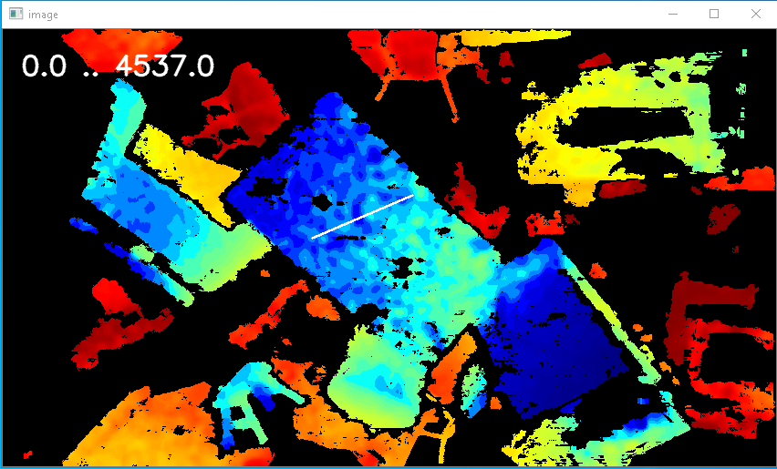
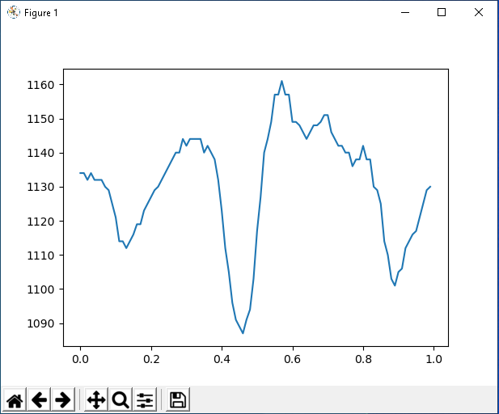
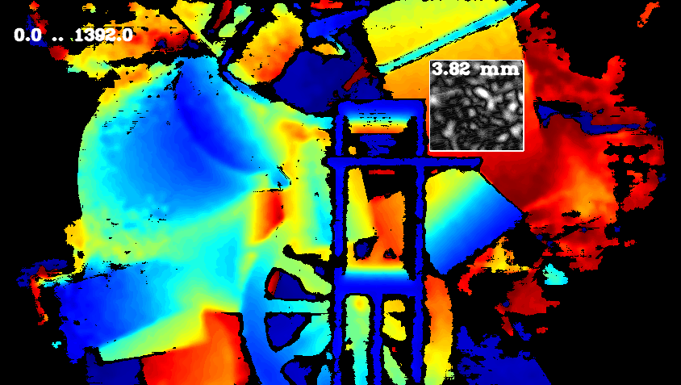
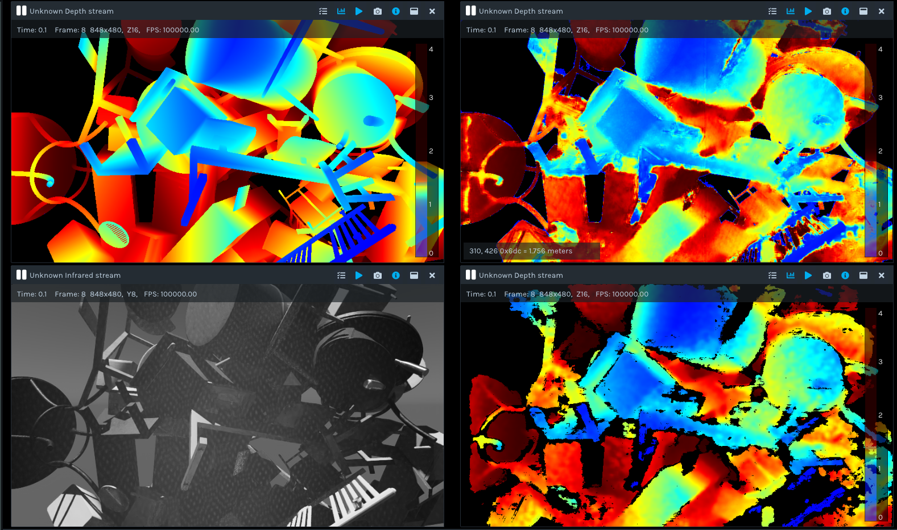
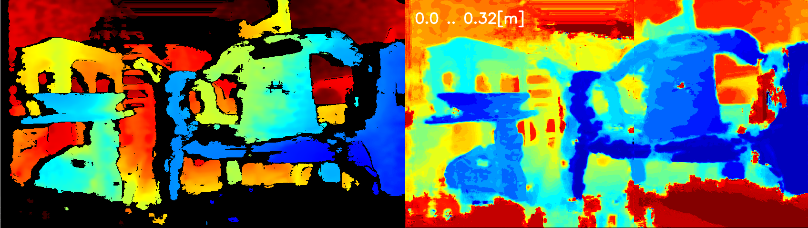

# Cross Section Tool

##### Used to show surface smoothness by showing depth of each pixel on a selected line on image


### Mark a line on image



### Pixels depth on a selected line



# RMSE Tool
##### Same goal as cross section tool with more flexibility. It gives RMSE of pixels in a selected rectangle.
##### The Whiter the pixels, the more far they are. 
##### Smooth surface will result in homogeneous pixels color in the selected rectangle


# Convert to Bag
This tool runs on a folder that contains:

	1. depth images as captured by ds5 camera
	
	2. ground truth of depth images from #1
	
	3. IR images from left sensor corresponding to #1 and #2
	
	4. denoised images : Unet network model prediction of noisy images from #1
	
The output is a bag file that could be opened by RealSense viewer.



# Camera Simulation
Shows how to use a trained network in live simulation. Run this command :

```py
python camera_simulation.py <path to the model>
```

Expected output is the original frame and model prediction given it as an input. 



